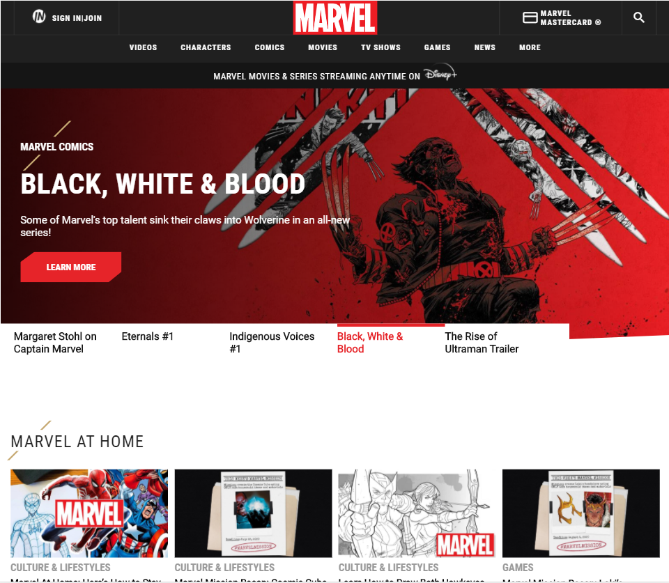

# Marvel Clone

En este proyecto hice desde cero un Clone de la página oficial de Marvel.
Solo usé HTML5 -CSS3- Responsive Design
Flexbox - Grid Layout-

Notas:
Widths:

- Mobile: 320px
- Desktop: 1024px

"Las imagenes fueron descargadas usando la extension de Chrome'Image Downloader'"

Clone page web Marvel, Espero les guste :)

gh-pages -> https://amaurysg.github.io/marvel/

